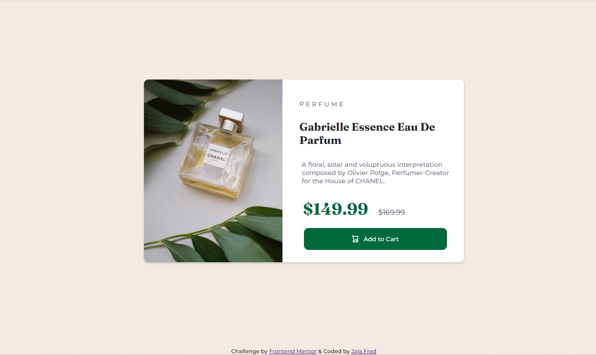
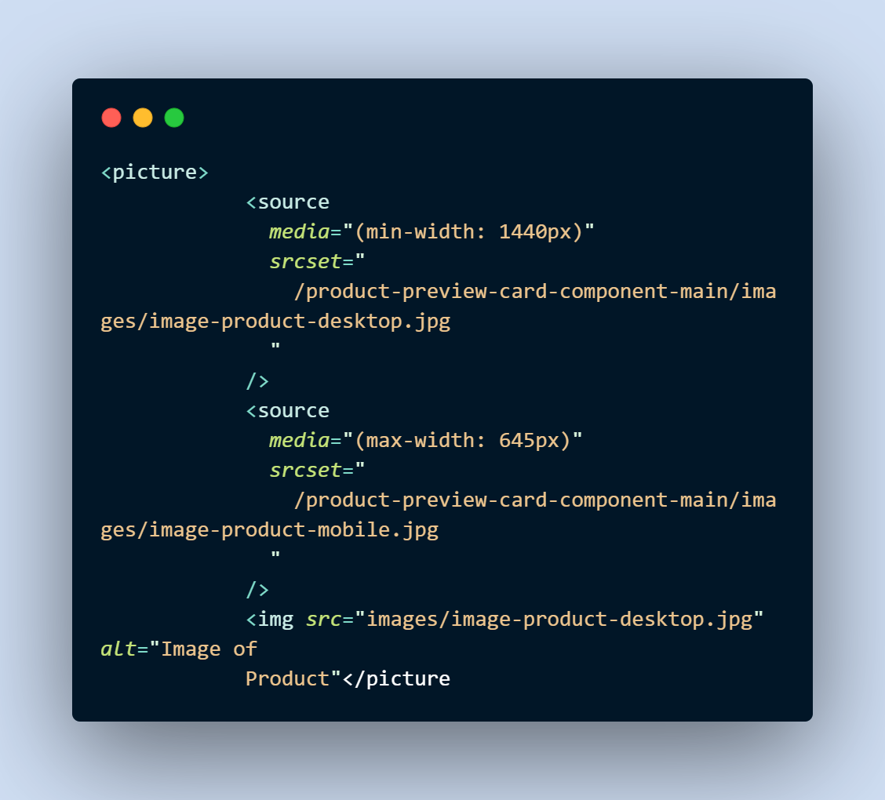

## Table of contents

- [Overview](#overview)
  - [The challenge](#the-challenge)
  - [Screenshot](#screenshot)
  - [Links](#links)
- [My process](#my-process)
  - [Built with](#built-with)
  - [What I learned](#what-i-learned)
  - [Continued development](#continued-development)
  - [Useful resources](#useful-resources)
- [Author](#author)
- [Acknowledgments](#acknowledgments)

## Overview

### The challenge

Users should be able to:

- View the optimal layout depending on their device's screen size
- See hover and focus states for interactive elements

### Screenshot

### Links

- Solution URL: https://github.com/Fredj17/Product-Preview-card.git
- Live Site URL: [Add live site URL here]

## My process

### Built with

- Semantic HTML5 markup
- CSS custom properties
- Flexbox
- CSS Grid
- Mobile-first workflow

### What I learned

- Image element with responsive design. Check image below
  

### Continued development

Css values and Units, Grids and Media queries

### Useful resources

- [Mdn web docs](https://developer.mozilla.org/) - This helped me for understand css values, units and grids a little bit and i will use it going forward.
- [Ww3school](https://ww3schools.com) - This is an amazing site which helped me understannd some basics in Css such as flexbox.

## Author

- Website - [Jaja Abinye Fred]
- Frontend Mentor - [Fredj17](https://www.frontendmentor.io/profile/Fredj17)

## Acknowledgments

I want to acknowledge and thank a friend of mine (https://github.com/davidabuu) for the advices and guidance while doing this project.
